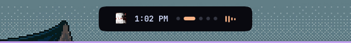
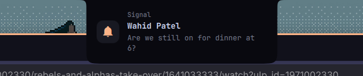
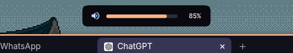
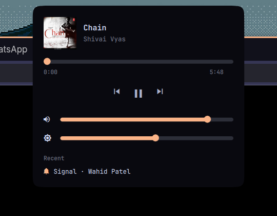
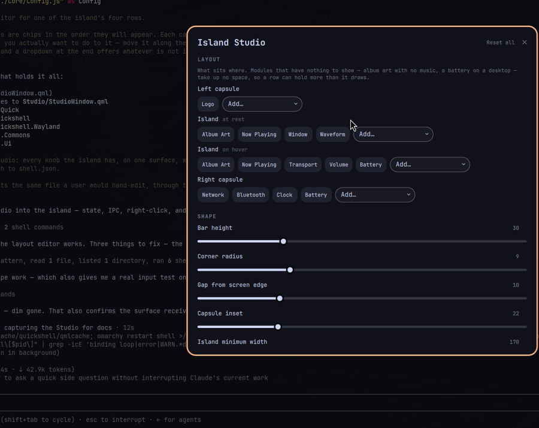

# Dynamic Island for Omarchy

A macOS-style menu bar that **replaces** the Omarchy bar: a glass capsule in
each corner with the island floating between them. The island grows album art
and a waveform when music plays, springs open for notifications, takes over the
system volume and brightness HUDs, and expands into a control centre on click.

```
 ╭─────╮            ╭────────────────────────╮      ╭──────────────────────────╮
 │  ✳  │            │  ▣  ♫ Now playing  ▮▮▮ │      │ ▾  ✻  Sun 20 Sep 13:09  ▯│
 ╰─────╯            ╰────────────────────────╯      ╰──────────────────────────╯
   logo                    the island                      status corner
```

All three shapes share a height, a centre line, a corner radius and the same
smoked black glass, so they read as one bar rather than three widgets. Only the
middle one changes size.









Everything in it is optional. You choose which modules sit in each capsule and
in the pill, which appear on hover, which events are allowed to take the island
over, and what the control centre contains. Set `"capsules": false` and you are
back to the bare floating pill.

---

## Requirements

- **Omarchy 4.0+** (needs the shell plugin system and `kind: "bar"` plugins)
- Hyprland, Quickshell 0.3+, Qt 6.6+
- A Nerd Font for the glyphs — Omarchy ships one by default
- `brightnessctl`, optionally, for the brightness slider

## Install

```bash
omarchy plugin add https://github.com/wahidpatel05/omarchy-dynamic-island.git
omarchy bar use wahidpatel.dynamic-island
```

`omarchy plugin add` clones the repo into `~/.config/omarchy/plugins/` and
leaves it disabled so you can read the code first. `omarchy bar use` is what
actually swaps your bar for the island.

> Plugins run unsandboxed inside `omarchy-shell`, with your user account. Read
> the source of anything you install, including this.

### Going back

The island is just the active bar option, so reverting is one command:

```bash
omarchy bar use omarchy.bar     # or your own bar's id
```

Your previous layout is untouched — it stays in `bar.layout` in
`~/.config/omarchy/shell.json` and comes straight back.

### Updating

```bash
omarchy plugin update wahidpatel.dynamic-island
```

---

## Configuring

Everything lives under `bar.island` in `~/.config/omarchy/shell.json`, and
**hot-reloads on save** — no restart.

```jsonc
{
  "bar": {
    "id": "wahidpatel.dynamic-island",
    "position": "top",
    "island": {
      "left": ["menu"],
      "right": ["network", "bluetooth", "clock", "battery"],
      "collapsed": ["albumArt", "media", "window", "waveform"],
      "hover": ["albumArt", "media", "mediaControls", "volume", "battery"],
      "expanded": ["media", "sliders", "notifications"]
    }
  }
}
```

Anything you leave out keeps its default. Arrays replace wholesale — writing
`"collapsed": ["clock"]` means *only* the clock.

There are ready-made configs in [`examples/`](examples/).

### The Studio

Or do none of that. Right-click the island — or run `omarchy-shell island
studio` — and every knob is on one surface: which modules sit in which row,
the shape, the material, the spring, and what is allowed to take the island
over.



There is no apply button and no preview mode, because there is nothing to
preview. The Studio writes to `bar.island` in your `shell.json` through the
same channel the shell already uses to hot-reload it, so the bar behind the
window reshapes as you drag — it is reading the value you just wrote. What
the Studio writes is exactly what you would have typed, which means hand
editing and the Studio can be mixed freely and neither surprises the other.

A control that you have changed grows a small reset next to it; *Reset all*
removes the `bar.island` key outright rather than writing the defaults out,
so the island keeps following them when they change.

The same settings are reachable from a script:

```bash
omarchy-shell island set shape.collapsedHeight 40
omarchy-shell island set right '["network","bluetooth","clock","battery"]'
omarchy-shell island set modules.clock.format "HH:mm"
omarchy-shell island get style.capsuleOpacity
omarchy-shell island unset shape          # back to the default
omarchy-shell island reset                # all of it
```

### Modules

The same vocabulary fills all four rows — `left` and `right` (the capsules),
`collapsed` (the resting pill) and `hover`. Put a module wherever you want it;
nothing is tied to one row.

| Name | Shows | Options |
|---|---|---|
| `albumArt` | Album art, on the pill's leading edge. Invisible with nothing playing. Click toggles playback | — |
| `waveform` | Playback visualiser. Moves while playing, settles flat when paused. Click skips | `bars` |
| `mediaControls` | Previous / play-pause / next | — |
| `clock` | Time and date. Click opens the calendar | `format` (Qt date format), `panel` |
| `workspaces` | Hyprland workspaces as dots; focused one stretches | `showEmpty`, `max` |
| `media` | Now-playing title with dancing bars. Hidden when nothing plays. Click toggles, middle-click skips | `maxTitleWidth` |
| `volume` / `audio` | Output volume glyph. Click mutes | `showPercentage` |
| `battery` | Charge glyph and percentage. Hidden on desktops. Click opens the power panel | `showPercentage`, `warnBelow`, `panel` |
| `network` | Wi-Fi arcs or an ethernet glyph, dimmed when offline. Click opens the Wi-Fi list | `panel`, `command` |
| `bluetooth` | Radio state, accented while something is connected. Hidden with no adapter. Click opens the device list | `panel`, `command` |
| `window` | The focused window's title. Steps aside while something is playing | `maxWidth`, `hideWhenPlaying` |
| `menu` | The system logo. Click opens the agent usage dashboard, right-click the Omarchy menu | `glyph`, `font`, `icon`, `size`, `panel`, `command`, `rightCommand` |
| `controlCentre` | Opens the island's control centre, and lights up while it is open | `glyph` |

Per-module options go in `modules`:

```jsonc
"modules": {
  "clock": { "format": "HH:mm" },
  "battery": { "warnBelow": 15, "showPercentage": false }
}
```

The `menu` module draws Omarchy's own mark, which lives in the `omarchy` font
rather than in your Nerd Font. Any glyph from any family can take its place —
or an image file, for a mark that is not in a font at all:

```jsonc
"modules": {
  "menu": {
    "glyph": "\uf179",                       // an Apple logo, from your Nerd Font
    "font": "",
    "rightCommand": "xdg-terminal-exec"
  }
}
```

```jsonc
"modules": {
  "menu": { "icon": "/usr/share/omarchy/shell/plugins/agents/assets/claude.svg" }
}
```

`icon` wins over `glyph` when it loads and falls back to it when it does not,
so a path that goes stale leaves a working button rather than an empty slot.

### Panels

The Wi-Fi list, the Bluetooth list, the calendar, the power panel and the
agent usage dashboard are Omarchy's own, not reimplementations. They are
`bar-widget` plugins — a bar button bundled with the popup it opens — and
Omarchy routes every `shell summon/hide/toggle` for them through whatever bar
is active. A bar that does not mount them does not merely fail to show them
itself: it makes them unreachable from keybindings and from the menu too.

So the island mounts them, invisibly, behind its own glyphs. `panel` on a
module names the plugin to put there:

```jsonc
"modules": {
  "network":   { "panel": "omarchy.network" },
  "bluetooth": { "panel": "omarchy.bluetooth" },
  "clock":     { "panel": "omarchy.clock" },
  "battery":   { "panel": "omarchy.power" },
  "menu":      { "panel": "omarchy.agents" }
}
```

You see the island's glyph; the click lands on Omarchy's widget underneath,
and the panel opens anchored to it — which is to say, directly under the thing
you clicked. Set `panel` to `""` and the module falls back to `command`, or to
doing nothing.

These all work too, and act on the island on the focused monitor:

```bash
omarchy-shell shell toggle omarchy.clock
omarchy-shell shell toggle omarchy.agents
```

### The capsules

```jsonc
"left":  ["menu"],
"right": ["network", "bluetooth", "clock", "battery"]
```

An empty array hides that capsule; `"behaviour": { "capsules": false }` turns
both off and leaves the bare pill, which is what the island was before.

The capsules are frosted rather than filled: smoked black glass, the same
material as the island they flank.

```jsonc
"style": {
  "capsuleOpacity": 0.55,
  "capsuleBorderWidth": 0,
  "capsuleHoverOpacity": 0.12
}
```

`capsuleBackground` takes a colour, or one of three palette roles —
`"foreground"`, `"background"`, `"accent"`. Black glass reads as a hole on a
light theme, so that is the case for `"foreground"`, which gives a pale wash
instead. A literal colour carries its own alpha and ignores `capsuleOpacity`.

Real refraction belongs to the compositor, not to the bar. Omarchy ships with
Hyprland's blur off; turning it on for this layer alone gets you the rest of
the way:

```lua
-- ~/.config/hypr/looknfeel.lua
hl.config({ decoration = { blur = { enabled = true, size = 6, passes = 3 } } })
hl.layer_rule({ blur = true, match = { namespace = "omarchy-dynamic-island" } })
hl.layer_rule({ ignore_alpha = 0.05, match = { namespace = "omarchy-dynamic-island" } })
```

Layer blur needs blur enabled globally — there is no way to turn it on for one
layer alone — though window blur still only shows up under windows that are
themselves translucent. The `ignore_alpha` rule matters too: the island's layer
surface spans the whole width of the screen and is mostly transparent, and
without it Hyprland blurs the empty parts as well.

### Activities

Transient events that take the island over. Highest priority wins when several
arrive at once.

| Name | Priority | Trigger |
|---|---|---|
| `volume` | 60 | Output volume or mute changes |
| `brightness` | 60 | Backlight changes |
| `notification` | 50 | A notification arrives |
| `power` | 40 | Charger plugged or unplugged, or battery runs low |
| `media` | 20 | The track changes while playing |

Volume and brightness sit above notifications on purpose: you just pressed a
key and want to see the result, so the HUD preempts rather than queues.

```jsonc
"activities": {
  "notification": { "enabled": true, "maxBodyLines": 2, "pauseOnHover": true },
  "volume":       { "enabled": true, "duration": 1500 },
  "brightness":   { "enabled": true, "duration": 1500 },
  "power":        { "enabled": true, "warnBelow": 20 },
  "media":        { "enabled": true, "duration": 2600 }
}
```

Hovering the island pauses a notification's dismissal countdown. Clicking it
dismisses it.

### Control centre

Click the island — or bind the IPC call below — to open it. Sections are listed
in `expanded`, top to bottom:

- `media` — album art, title, scrubber, transport
- `sliders` — volume, and brightness where a backlight exists
- `notifications` — the recent few

### Shape and motion

```jsonc
"shape": {
  "collapsedWidth": 170,
  "collapsedHeight": 30,
  "radiusBottom": 9,
  "radiusTop": 9,
  "fillet": 15,
  "curvature": 2.6,
  "topInset": 10,

  "sideMargin": 22,
  "capsuleHeight": 0,
  "capsuleRadius": 0,
  "capsulePaddingX": 11,
  "capsuleSpacing": 2,
  "capsuleFontSize": 0,
  "capsuleGap": 18
},
"motion": {
  "response": 0.42,
  "damping": 0.72
}
```

`collapsedHeight` sizes the whole bar: the capsules take their height from it
unless `capsuleHeight` says otherwise, so there is one number to change rather
than three to keep in sync. The `capsule*` keys that default to `0` are all
derived — the radius from the height, the type size from the height and your
theme's body size, whichever is larger.

`curvature` is the superellipse exponent for the corners. `2` gives ordinary
circular corners, which is what macOS uses at this size; `5` is a squircle;
past `8` it starts to read as a bevel.

Each module in a capsule gets a slot as wide as the capsule is tall, which is
where the status corner's even pitch comes from — `capsuleSpacing` is the gap
*between* those slots, so it wants to be small.

`topInset` is the gap between the island and the screen edge. It defaults to
`9`, so the island **floats**. Set it to `0` to sit flush against the bezel like
a MacBook notch — at which point `fillet` kicks in, drawing concave shoulders
that blend the island into the top edge. Floating ignores `fillet`, because
there is no edge left to blend into. See [`examples/notch.json`](examples/notch.json).

`motion` is a real spring, not an easing preset. `response` is roughly the time
in seconds to first reach the target, and `damping` controls overshoot: `1.0`
settles dead, `0.72` gives a ~4% pop, below `0.5` visibly bounces.

### Appearance

```jsonc
"style": {
  "darken": 0.0,
  "opacity": 1.0,
  "accent": "",
  "capsuleOpacity": 0.55
}
```

Text and accents follow the active Omarchy theme; the shapes themselves do
not. `darken` is how much of the theme's background colour the island keeps —
`0.0` is pure black, which is what a notch actually looks like, and `1.0`
matches the theme. Set any colour explicitly to override.

### Behaviour

```jsonc
"behaviour": {
  "reserveSpace": true,
  "monitors": "all",
  "activityMonitors": "all",
  "capsules": true,
  "expandOnHover": true,
  "closeOnLeave": true,
  "scrollGestures": true,
  "captureOmarchyOsd": false
}
```

`reserveSpace` reserves screen space for the *resting* height only, so windows
tile below the pill and the island expands over them — a notification never
reflows your desktop. Set it `false` to make the island a pure overlay.

### Multiple displays

Every display gets its own island by default, capsules and all, and each one
keeps its own hover and control-centre state — opening the control centre on
one screen leaves the others at rest.

```jsonc
"monitors": "all"                        // every display (default)
"monitors": "focused"                    // only the display with focus, following it
"monitors": "DP-1"                       // pinned to one connector
"monitors": ["eDP-1", "HDMI-A-1"]        // a specific subset
```

A name that does not match anything falls back to every display, so a typo or
an unplugged monitor leaves you with a bar rather than without one.

`activityMonitors` decides how far a transient event travels. `"all"` mirrors
notifications and HUDs onto every island; `"focused"` plays them only on the
display that has focus, which is worth setting if a volume HUD appearing on
three screens at once bothers you.

---

## HUDs: replacing the system OSD

Out of the box the island watches PipeWire and the backlight directly, so
volume and brightness changes appear in the island however they were made — a
media key, `wpctl`, a mixer, another app. Omarchy's own OSD is still running
though, so you will see **both**.

To make the island the only HUD, hand it Omarchy's OSD stream:

```bash
omarchy plugin disable omarchy.osd
```

```jsonc
"behaviour": { "captureOmarchyOsd": true }
```

This is better than simply disabling Omarchy's OSD and leaving it at that.
Omarchy's OSD serves more than volume and brightness — microphone mute,
keyboard backlight, touchpad toggle, audio output switching — and the island
only watches the first two on its own. Capturing the stream means *every* OSD
Omarchy would have shown is drawn by the island instead, so nothing is lost.

Turn both on together. Two handlers cannot share the `osd` IPC target and the
winner is decided by registration order, so enabling capture while Omarchy's
OSD is still running is a coin flip rather than an upgrade. When capture is on,
the island's own volume and brightness watchers stand down, since the captured
stream already carries them.

---

## Gestures

With the pointer over the island:

| Gesture | Does |
|---|---|
| Scroll up / down | Volume up / down |
| Shift-scroll, or horizontal scroll | Next / previous track |
| Click | Open the control centre |
| Click during a notification | Dismiss it |
| Click the album art | Play / pause |
| Click the waveform | Next track |
| Click the logo | Open the agent usage dashboard (right-click: the Omarchy menu) |
| Click Wi-Fi / Bluetooth / the clock / the battery | Open that panel |
| Click the control centre glyph | Open the island's control centre |
| Right-click the island | Open the Studio |

Turn the wheel bindings off with `"behaviour": { "scrollGestures": false }`.

---

## Notifications

By default the island **mirrors** Omarchy's notification service. You get the
island card *and* the usual corner toast, and history, do-not-disturb and the
notification panel all keep working.

For island-only notifications, hand it the bus:

```bash
omarchy plugin disable omarchy.notifications
```

```jsonc
"activities": { "notification": { "source": "own" } }
```

Only one process on the session can own `org.freedesktop.Notifications`, so do
both or neither. There is deliberately no auto-detect: the shell mounts plugin
services several seconds after the bar, which makes "is Omarchy's service
running?" unanswerable at startup, and guessing wrong means two servers racing
for the bus on every login.

Note that `source: "own"` gives up Omarchy's notification history and DND.

---

## Keybinding

The island exposes an IPC target:

```bash
omarchy-shell island toggle     # open/close the control centre
omarchy-shell island expand
omarchy-shell island collapse
omarchy-shell island studio     # open/close the Studio
omarchy-shell island state
```

Bind them in `~/.config/hypr/bindings.lua`:

```lua
o.bind("SUPER", "I", "omarchy-shell island toggle")
o.bind("SUPER + SHIFT", "I", "omarchy-shell island studio")
```

---

## Troubleshooting

**The bar disappeared and nothing came back.** Omarchy falls back to the
built-in bar if a bar plugin fails to load. Check for errors:

```bash
journalctl --user -t omarchy-shell -n 50 | grep dynamic-island
```

**Changes to `shell.json` do nothing.** The island hot-reloads config, but
editing the plugin's own QML needs `omarchy restart shell`. Note that
`.pragma library` JavaScript is cached by the QML engine, so a rescan is not
always enough.

**Glyphs render as boxes.** The modules use Nerd Font glyphs; make sure your
terminal/system font is a Nerd Font variant.

---

## Development

```bash
git clone https://github.com/wahidpatel05/omarchy-dynamic-island.git
ln -s "$PWD/omarchy-dynamic-island" ~/.config/omarchy/plugins/wahidpatel.dynamic-island
omarchy-shell shell rescanPlugins
omarchy bar use wahidpatel.dynamic-island
```

Layout:

```
Island.qml          plugin root: config, colours, activity routing, IPC
Core/               geometry, motion, OSD icon names, the morphing window, the
                    glass capsules, the host for Omarchy's own panels, shared
                    widgets
Modules/            things that sit in a capsule or in the pill
Activities/         things that take the island over
Expanded/           the control centre
Studio/             the settings surface, and the write path back to shell.json
Services/           notification, media and brightness sources
```

Two things worth knowing before you touch the animation code:

- **Qt's bezier easing corrupts the heap above 10 cubic segments.**
  `BezierEase` preallocates exactly 10 slots and never bounds-checks them, so a
  longer spline smears over adjacent allocations and the process dies later,
  somewhere unrelated. `Core/Motion.js` caps at 10 deliberately.
- **Never size anything from a word-wrapped `Text`'s `implicitWidth`.** It is
  derived from the width you gave it, so it closes a binding loop — and with a
  `Behavior` on the far end, that loop recurses until the stack gives out. Use
  `TextMetrics` to measure instead.
- **Never size a `Loader` from its own `implicitWidth`.** `QQuickLoader`
  recomputes that from its item every time it is resized, so
  `width: Math.max(implicitWidth, …)` re-enters and Qt reports a binding loop.
  `ModuleRow` wraps each Loader in a plain Item and sizes that instead.
- **Never read a hosted item's `visible` to decide whether to show it.**
  Reading `visible` gives the *effective* value, which already includes the
  parent's — so a parent whose visibility depends on its child's latches both
  to false and never recovers. Modules declare presence through `shown`, which
  is an ordinary property, for exactly this reason.

## License

MIT — see [LICENSE](LICENSE).
